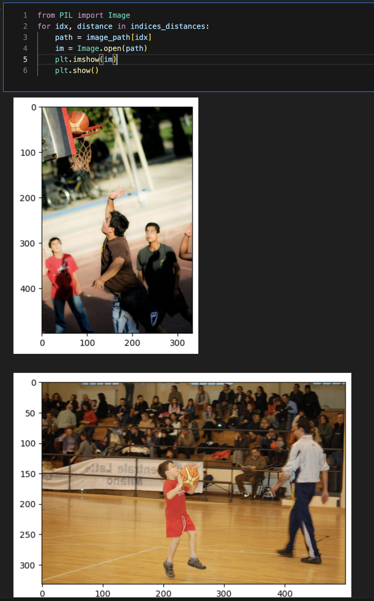

# Building a Semantic Image Search Engine with OpenAI's CLIP and Faiss

The following exercise uses **CLIP** model from **OpenAI** to build the embeddings and **Facebook’s FAISS** library for Indexing. It also uses **Flicker 30k Dataset** available on **Kaggle**.

## Prerequisites

You need to have the following installed:

* Python 3.7+
* PyTorch 1.7+
* Transformers
* Datasets
* Faiss
* Numpy
* Pandas
* Matplotlib
* Pillow
* Tqdm

You can install the required packages using
`pip install -r requirements.txt`

## Usage

Once the dataset is downloaded from <a href="https://www.kaggle.com/datasets/adityajn105/flickr30k">Kaggle</a>, add the notebook where the image folder is located. Make the required changes to the path and run.

The script also includes a demonstration of how to perform a search. The text query "basketball game" is encoded and compared to the image embeddings using Faiss to find the most similar images. The paths of these images are then used to load and display the images.

## Example
